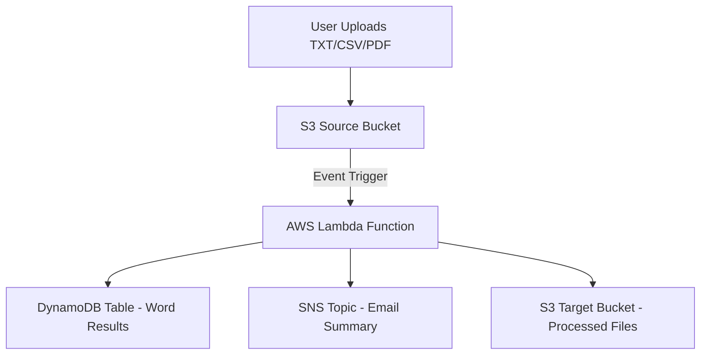

# 🧠 Simple Word Analysis Serverless App

A **fully serverless AWS application** that performs **automatic word analysis** on files uploaded to Amazon S3.  
When a `.txt`, `.csv`, or `.pdf` file is uploaded, an **AWS Lambda** function is triggered to extract text, calculate word statistics, and store results in **Amazon DynamoDB**.  
A **summary report** is sent to all **Amazon SNS** email subscribers, and the processed file is archived in a target S3 bucket.

All components are deployed and managed automatically via **Python scripts using Boto3**, making this a great reference project for learning AWS automation and serverless architecture.

---

## 🧩 Table of Contents

- [Features](#-features)
- [Architecture Overview](#-architecture-overview)
- [Detailed Workflow](#-detailed-workflow)
- [Project Structure](#-project-structure)
- [AWS Services Used](#-aws-services-used)
- [Prerequisites](#-prerequisites)
- [Deployment](#-deployment)
- [Cleanup](#-cleanup)
- [Example Workflow](#-example-workflow)
- [Sample Output](#-sample-output)
- [Technical Notes](#-technical-notes)
- [Learning Objectives](#-learning-objectives)
- [Future Enhancements](#-future-enhancements)
- [License](#-license)

---

## 🚀 Features

✅ **Serverless architecture** built with AWS Lambda and S3 triggers.  
✅ **Supports multiple file formats**: TXT, CSV, and PDF.  
✅ **Extracts text and counts word frequencies** automatically.  
✅ **Stores results** (word counts, file metadata, timestamps) in DynamoDB.  
✅ **Publishes results** to an SNS topic (email summary).  
✅ **Auto-archives** processed files to a target S3 bucket.  
✅ **Automated deployment and teardown** via Python scripts.  
✅ **Timestamp-based resource naming** to avoid conflicts.  
✅ **Zero manual AWS Console setup** required.

---

## 🏗️ Architecture Overview

### 📘 High-Level Architecture

```text
                 ┌────────────────────┐
                 │    User Uploads     │
                 │ (TXT, CSV, or PDF)  │
                 └──────────┬──────────┘
                            │
                            ▼
                   ┌────────────────┐
                   │  S3 Source      │
                   │   Bucket        │
                   └──────┬──────────┘
                          │ (Event Trigger)
                          ▼
                   ┌───────────────────────┐
                   │     AWS Lambda         │
                   │ (Word Analysis Logic)  │
                   └────────┬───────────────┘
                            │
       ┌────────────────────┼────────────────────────┐
       ▼                    ▼                        ▼
┌──────────────┐     ┌──────────────┐         ┌────────────────┐
│  DynamoDB    │     │   SNS Topic  │         │   S3 Target     │
│ Word Counts  │     │ Email Alerts │         │ (Processed Files│
└──────────────┘     └──────────────┘         └────────────────┘
````

### 🧭 Mermaid Diagram (for GitHub Preview)



---

## 🔍 Detailed Workflow

1. **File Upload**

   * A user uploads a text-based file to the **source S3 bucket**.
   * File types supported: `.txt`, `.csv`, `.pdf`.

2. **Event Trigger**

   * The S3 upload event automatically invokes the **Lambda function**.

3. **File Processing**

   * The Lambda function:

     * Downloads the uploaded file.
     * Detects file type and extracts text (PDF/CSV/TXT).
     * Cleans and tokenizes words.
     * Counts total and unique words.
     * Calculates the top most frequent words.

4. **Data Storage**

   * The processed data is stored in **DynamoDB**:

     * File name
     * Upload timestamp
     * Total and unique word count
     * Top 10 frequent words
     * Processing duration

5. **Notification**

   * A **summary JSON message** is published to an **SNS topic**.
   * All subscribed email addresses receive a formatted summary.

6. **Archival**

   * The original file is copied to the **target S3 bucket** (for archiving).

7. **Cleanup (Optional)**

   * Run `cleanup.py` to delete all AWS resources created within the last 24 hours.

---

## 📁 Project Structure

```bash
.
├── deploy.py        # Deploys all AWS resources and Lambda
├── cleanup.py       # Removes resources created in the last 24 hours
├── lambda_function/ # (optional) Lambda code if stored separately
├── README.md        # Documentation (this file)
```

---

## ☁️ AWS Services Used

| AWS Service         | Purpose                                   | Example Resource                                         |
| ------------------- | ----------------------------------------- | -------------------------------------------------------- |
| **Amazon S3**       | File storage and event triggering         | `source-bucket-<timestamp>`, `target-bucket-<timestamp>` |
| **AWS Lambda**      | Executes text extraction and analysis     | `lambda-word-analysis-<timestamp>`                       |
| **Amazon DynamoDB** | Stores analysis results and metadata      | `WordCountTable-<timestamp>`                             |
| **Amazon SNS**      | Sends email summaries to subscribers      | `word-analysis-topic-<timestamp>`                        |
| **AWS IAM**         | Provides roles and permissions for Lambda | `lambda-role-<timestamp>`                                |

---

## 🧰 Prerequisites

Before deploying the project, make sure you have:

* **Python 3.x**
* **AWS CLI** (configured with credentials)
* **Boto3** installed:

```bash
pip install boto3
```

* AWS account with permission to create:

  * S3 buckets
  * Lambda functions
  * DynamoDB tables
  * SNS topics and subscriptions
  * IAM roles and policies

---

## ⚙️ Deployment

### 1️⃣ Run the Deploy Script

```bash
python deploy.py
```

During execution, you’ll be prompted to enter one or more email addresses (comma-separated) for SNS notifications.

### 2️⃣ Deployment Actions Performed

`deploy.py` automatically:

1. Creates two **S3 buckets** (source + target) with timestamped names.
2. Creates an **SNS topic** and subscribes provided email addresses.
3. Creates an **IAM role** for Lambda with policies for S3, DynamoDB, and SNS.
4. Creates a **DynamoDB table** for storing word analysis results.
5. Deploys the **Lambda function** that performs the analysis.
6. Configures an **S3 → Lambda event trigger**.

After successful deployment, the script displays:

* Source bucket name
* Target bucket name
* DynamoDB table name
* SNS topic ARN

---

## 🧹 Cleanup

To delete all resources created in the last 24 hours:

```bash
python cleanup.py
```

This script automatically:

* Deletes **Lambda functions** and related IAM roles.
* Removes **S3 buckets** and their contents.
* Deletes **SNS topics** and subscriptions.
* Removes **DynamoDB tables**.
* Ensures **clean resource teardown** to avoid AWS charges.

---

## 🧾 Example Workflow

1. Deploy resources:

   ```bash
   python deploy.py
   ```

2. Upload a file (e.g., `sample.txt` or `words.csv`) to the **source S3 bucket**.

3. Wait a few seconds — the **Lambda function** runs automatically.

4. Receive an **SNS email notification** containing a summary.

5. View detailed analysis in the **DynamoDB table**.

6. Processed files will appear in the **target S3 bucket**.

7. When done:

   ```bash
   python cleanup.py
   ```

---

## 🧮 Sample Output (SNS JSON Message)

A typical SNS message (email body) sent after file analysis:

```json
{
  "file_name": "example.txt",
  "upload_timestamp": "2025-10-20T09:45:33Z",
  "total_words": 1254,
  "unique_words": 346,
  "top_words": [
    {"word": "data", "count": 56},
    {"word": "analysis", "count": 42},
    {"word": "aws", "count": 39},
    {"word": "lambda", "count": 32},
    {"word": "word", "count": 30}
  ],
  "language_detected": "en",
  "processing_time_ms": 583,
  "result_status": "SUCCESS",
  "storage": {
    "dynamodb_table": "WordCountTable-20251020-094533",
    "s3_target_bucket": "target-bucket-20251020-094533"
  },
  "message": "File successfully processed and archived."
}
```

---

## 🧠 Technical Notes

* **Text Extraction**:

  * `.txt` → Direct read.
  * `.csv` → Concatenates all text columns.
  * `.pdf` → Uses PyPDF2 for text extraction.

* **Performance**:

  * Lambda timeout: ~30s.
  * Memory: 256–512 MB (configurable).
  * Suitable for small to medium files (<5 MB).

* **Data Storage Format**:

  * DynamoDB uses file name as primary key.
  * Stores total counts, word frequencies (as a map), and timestamp.

* **Security**:

  * IAM role follows least-privilege principle.
  * SNS subscribers must confirm via email before receiving messages.

* **Extensibility**:

  * Easily extendable to include:

    * Sentiment Analysis (via Amazon Comprehend)
    * Translation (via Amazon Translate)
    * Entity Recognition or Language Detection

---

## 🎯 Learning Objectives

This project helps you learn:

* How to build **event-driven serverless pipelines** on AWS.
* How to automate infrastructure using **Boto3**.
* How to integrate **S3, Lambda, DynamoDB, and SNS**.
* How to handle text extraction and simple NLP logic in AWS Lambda.
* How to manage **resource lifecycle** (creation → processing → deletion).

---

## 🔮 Future Enhancements

* Add **CloudWatch dashboards** for real-time monitoring.
* Integrate **AWS Step Functions** for multi-stage workflows.
* Use **AWS Comprehend** for advanced NLP tasks.
* Add **API Gateway endpoint** for manual word analysis submission.
* Store detailed logs in **S3 or CloudWatch Logs** for auditability.

---

## 🪪 License

This project is licensed under the **MIT License**.
You are free to use, modify, and distribute it for educational and personal projects.

---

**Author:** *Mohamad Ikhsan Nurulloh*
**Created For:** *Educational demonstration of AWS Serverless automation using Python (Boto3)*
**Last Updated:** *October 2025*
