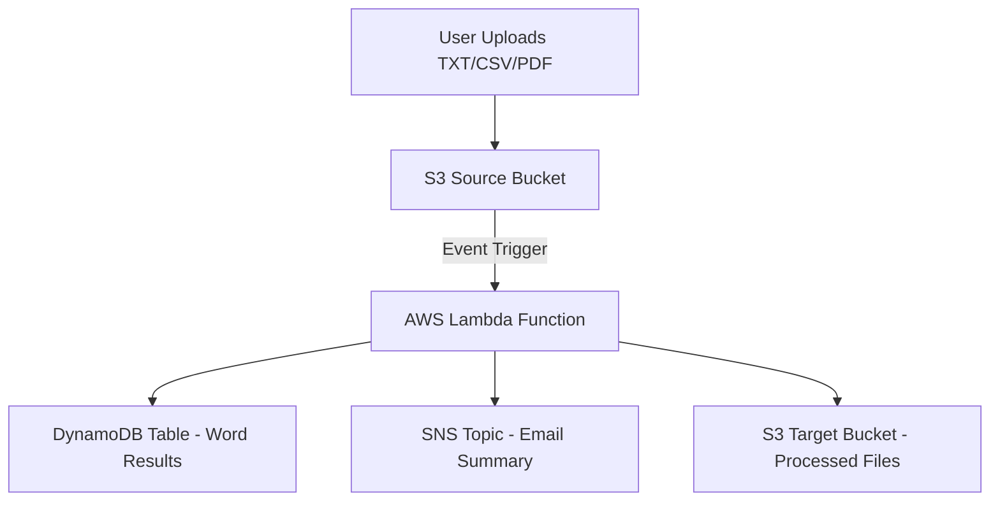

# Simple Word Analysis Serverless App

This project demonstrates a **fully serverless AWS application** that performs **automatic word analysis** on files uploaded to Amazon S3.  
When a `.txt`, `.csv`, or `.pdf` file is uploaded, an **AWS Lambda** function is triggered to extract text, calculate word statistics, and store results in **Amazon DynamoDB**.  
A **summary report** is then sent to all **Amazon SNS** email subscribers, and the processed file is archived in a target S3 bucket.

All components are deployed and managed automatically using **Python scripts with Boto3**, making this project a practical reference for learning AWS automation and serverless architecture.

---

## Table of Contents

- [Features](#features)
- [Architecture Overview](#architecture-overview)
- [Detailed Workflow](#detailed-workflow)
- [Project Structure](#project-structure)
- [AWS Services Used](#aws-services-used)
- [Prerequisites](#prerequisites)
- [Deployment](#deployment)
- [Cleanup](#cleanup)
- [Example Workflow](#example-workflow)
- [Sample Output](#sample-output)
- [Technical Notes](#technical-notes)
- [Learning Objectives](#learning-objectives)
- [Future Enhancements](#future-enhancements)
- [License](#license)

---

## Features

- **Serverless architecture** built using AWS Lambda and S3 triggers.  
- Supports **TXT**, **CSV**, and **PDF** file formats.  
- Automatically **extracts text** and **counts word frequencies**.  
- **Stores analysis results** in DynamoDB.  
- **Publishes JSON summaries** to an SNS topic (email notifications).  
- **Archives processed files** in a target S3 bucket.  
- **Automated deployment and cleanup** using Python and Boto3.  
- **Timestamp-based resource naming** to avoid name conflicts.  
- **Zero manual setup** required through the AWS Console.

---

## Architecture Overview

### High-Level Architecture

```text
                 ┌────────────────────┐
                 │    User Uploads     │
                 │ (TXT, CSV, or PDF)  │
                 └──────────┬──────────┘
                            │
                            ▼
                   ┌────────────────┐
                   │  S3 Source      │
                   │   Bucket        │
                   └──────┬──────────┘
                          │ (Event Trigger)
                          ▼
                   ┌───────────────────────┐
                   │     AWS Lambda         │
                   │ (Word Analysis Logic)  │
                   └────────┬───────────────┘
                            │
       ┌────────────────────┼────────────────────────┐
       ▼                    ▼                        ▼
┌──────────────┐     ┌──────────────┐         ┌────────────────┐
│  DynamoDB    │     │   SNS Topic  │         │   S3 Target     │
│ Word Counts  │     │ Email Alerts │         │ (Processed Files│
└──────────────┘     └──────────────┘         └────────────────┘
````

### Mermaid Diagram (for GitHub Preview)



---

## Detailed Workflow

1. **File Upload**

   * A user uploads a text-based file to the **source S3 bucket**.
   * Supported file types: `.txt`, `.csv`, `.pdf`.

2. **Event Trigger**

   * The S3 upload event automatically invokes the **Lambda function**.

3. **File Processing**

   * The Lambda function:

     * Downloads the file from S3.
     * Detects file type and extracts text (using appropriate parser).
     * Cleans and tokenizes words.
     * Counts total and unique words.
     * Identifies top frequent words.

4. **Data Storage**

   * The processed results are stored in **DynamoDB**, including:

     * File name
     * Upload timestamp
     * Word count summary
     * Processing duration

5. **Notification**

   * A JSON-formatted summary is published to an **SNS topic**.
   * All subscribed email addresses receive the notification.

6. **Archival**

   * The processed file is copied to the **target S3 bucket**.

7. **Cleanup (Optional)**

   * Run `cleanup.py` to delete all AWS resources created within the last 24 hours.

---

## Project Structure

```bash
.
├── deploy.py        # Deploys all AWS resources and Lambda
├── cleanup.py       # Removes resources created in the last 24 hours
├── lambda_function/ # Optional: Directory for Lambda source code
├── README.md        # Project documentation
```

---

## AWS Services Used

| AWS Service         | Purpose                                         | Example Resource                                          |
| ------------------- | ----------------------------------------------- | --------------------------------------------------------- |
| **Amazon S3**       | Stores source and processed files               | `source-bucket-<timestamp>` / `target-bucket-<timestamp>` |
| **AWS Lambda**      | Executes text extraction and analysis           | `lambda-word-analysis-<timestamp>`                        |
| **Amazon DynamoDB** | Stores word count results and metadata          | `WordCountTable-<timestamp>`                              |
| **Amazon SNS**      | Sends email summaries to subscribers            | `word-analysis-topic-<timestamp>`                         |
| **AWS IAM**         | Provides Lambda execution roles and permissions | `lambda-role-<timestamp>`                                 |

---

## Prerequisites

* **Python 3.x**
* **AWS CLI** (configured with valid credentials)
* **Boto3** library installed:

  ```bash
  pip install boto3
  ```
* AWS account with permissions to create:

  * S3 buckets
  * Lambda functions
  * DynamoDB tables
  * SNS topics and subscriptions
  * IAM roles and policies

---

## Deployment

### Step 1: Run the Deployment Script

```bash
python deploy.py
```

You will be prompted to enter one or more email addresses (comma-separated) to subscribe to the SNS topic.

### Step 2: Script Actions

`deploy.py` performs the following automatically:

1. Creates timestamped **S3 buckets** (source and target).
2. Creates an **SNS topic** and subscribes your email addresses.
3. Creates an **IAM role** for Lambda with S3, DynamoDB, and SNS permissions.
4. Creates a **DynamoDB table** for storing analysis results.
5. Deploys the **Lambda function** with analysis logic.
6. Configures **S3 → Lambda** event trigger.

Upon successful completion, the script outputs:

* Source bucket name
* Target bucket name
* DynamoDB table name
* SNS topic ARN

---

## Cleanup

To remove all resources created in the last 24 hours:

```bash
python cleanup.py
```

This script deletes:

* Lambda functions and IAM roles
* S3 buckets and their contents
* SNS topics and subscriptions
* DynamoDB tables

All deletions are timestamp-filtered to prevent accidental removal of older resources.

---

## Example Workflow

1. Deploy resources:

   ```bash
   python deploy.py
   ```
2. Upload a file (e.g., `example.txt` or `example.csv`) to the **source S3 bucket**.
3. Wait a few seconds for processing to complete.
4. Receive a **JSON summary email** via SNS.
5. View detailed results in the **DynamoDB table**.
6. Access the archived file in the **target S3 bucket**.
7. When done, run:

   ```bash
   python cleanup.py
   ```

---

## Sample Output (SNS JSON Message)

An example of the JSON payload sent via SNS after successful processing:

```json
{
  "file_name": "example.txt",
  "upload_timestamp": "2025-10-20T09:45:33Z",
  "total_words": 1254,
  "unique_words": 346,
  "top_words": [
    {"word": "data", "count": 56},
    {"word": "analysis", "count": 42},
    {"word": "aws", "count": 39},
    {"word": "lambda", "count": 32},
    {"word": "word", "count": 30}
  ],
  "language_detected": "en",
  "processing_time_ms": 583,
  "result_status": "SUCCESS",
  "storage": {
    "dynamodb_table": "WordCountTable-20251020-094533",
    "s3_target_bucket": "target-bucket-20251020-094533"
  },
  "message": "File successfully processed and archived."
}
```

---

## Technical Notes

* **Text Extraction:**

  * `.txt`: Read directly from file.
  * `.csv`: Concatenate all text-based columns.
  * `.pdf`: Extract text using PyPDF2 or similar libraries.

* **Performance:**

  * Lambda timeout: up to 30 seconds.
  * Memory: 256–512 MB.
  * Suitable for small-to-medium text files (<5 MB).

* **Data Storage Format:**

  * DynamoDB uses `file_name` as primary key.
  * Stores total word count, unique word count, top frequent words, and timestamp.

* **Security:**

  * IAM roles follow least-privilege principles.
  * SNS subscribers must confirm via email before receiving messages.

* **Extensibility:**

  * Can be extended to integrate:

    * AWS Comprehend for NLP
    * AWS Translate for multilingual support
    * Step Functions for multi-stage workflows

---

## Learning Objectives

This project demonstrates how to:

* Build **event-driven serverless applications** using AWS.
* Automate **resource provisioning** and **teardown** with Boto3.
* Integrate **S3, Lambda, DynamoDB, and SNS** for data pipelines.
* Implement **text extraction and word frequency analysis** in a serverless context.
* Design for **cost efficiency** and **scalability** in AWS.

---

## Future Enhancements

* Add CloudWatch dashboards for monitoring performance metrics.
* Integrate Step Functions for orchestration of complex workflows.
* Use AWS Comprehend for sentiment or entity analysis.
* Expose Lambda through API Gateway for on-demand text analysis.
* Log all activities to CloudWatch for audit and debugging.

---

## License

This project is licensed under the **MIT License**.
You are free to use, modify, and distribute it for educational and personal projects.

---

**Author:** Mohamad Ikhsan Nurulloh
**Purpose:** Educational demonstration of AWS Serverless automation using Python and Boto3
**Last Updated:** October 2025
